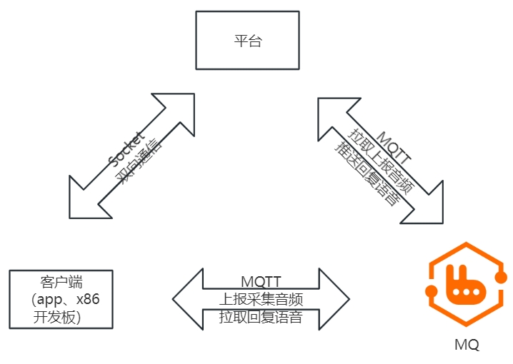
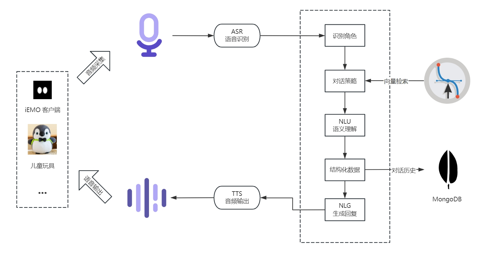
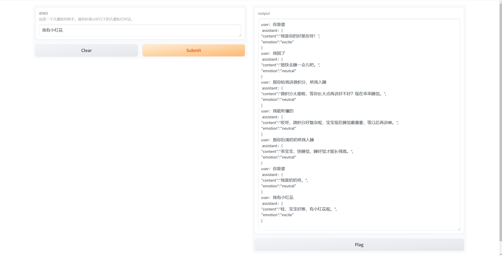

# 人机交互程序：iEMO 
## 

[**镜像加速地址**](https://gitee.com/DeveloperDaYao/iEMO)

iEMO是一款接入了大语言模型的人机交互程序，具备听（自动语音识别）、说（让机器说话）、思（像人类一样思考）、忆（记忆）的能力。她的定位是10岁儿童的陪伴助手。她会以和小孩相处的方式陪伴孩子聊天。她会唐诗、宋词，上知天文下知地理，最重要的是她会以10岁小孩该有的认知回答问题。但，若你问她三角函数、微积分等，嗯~，她可能会拒绝你。

iEMO的产品形态为一款儿童玩具，是毛绒的、抗摔，和不易碎的。iEMO和小孩是陪伴的关系，小孩在iEMO这里学到知识，iEMO学习孩子的说话风格、对话日常，在互相陪伴的过程中iEMO会形成独特的性格特点。每个iEMO都是独立的个体，她具备人的情绪与记忆。


## 🧭文档导航
1. [app终端](client/iEMO/README.md)
2. [平台服务终端](server/README.md)
3. [平台服务终端 - LLM模块](server/module/brain/README.md)
4. [平台服务终端 - TTS模块](server/module/speak/README.md)
5. [单片机终端](client/iEMO-C/README.md)


## 💡需讨论的想法记录在这里
- [ ] 在此基础上可以增设其他角色，如：面对职场白领的`解压助手`、` 夸夸我` 、`受气包`等。
- [ ] 视觉模块：增设视觉检测可触发更有意思的对话场景，如：
	1. iEMO可以轻易的叫出你的名字，看见陌生面孔会问：“ta是谁？”。
	2. 你可以拿着苹果问：“这是什么？”，iEMO会告诉你：“这是苹果”。
	
	`隐私风险、家长的接受程度能有多少？`

- [ ] 引入游戏功能：成语接龙。
- [ ] 儿童玩具载体增加舵机，对话过程中可进行动作反馈。


### ℹ项目架构说明
#### 名词术语约定
| 简写     | 描述     |
| -------- | -------- |
| ASR | 自动语音识别（Automatic Speech Recognition，ASR） |
| NLU | 自然语言理解(Natural Language Understanding, NLU) |
| NLG | 自然语言生成(Natural Language Generation, NLG) |
| TTS | 文本转语音(Text To Speech, TTS) |


#### 终端通信方式

#### 数据处理流程



## 📂目录结构说明
```
├─client
│  ├─iEMO //app终端程序
│  └─iEMO-C //单片机程序位置
├─docs
└─server //服务端程序
    └─module //各模块，按目录区分，随地替换
        ├─auditory //音频识别模块，对应“听”
        ├─brain //语义处理，核心
        └─speak //TTS模块，对应“说”
```
## 🚀安装
### [运行客户端](client/iEMO/README.md)


### [运行服务端](server/README.md)


###### 引用
> [1] https://github.com/peng-zhihui/ElectronBot/tree/main/4.CAD-Model/Emoji

