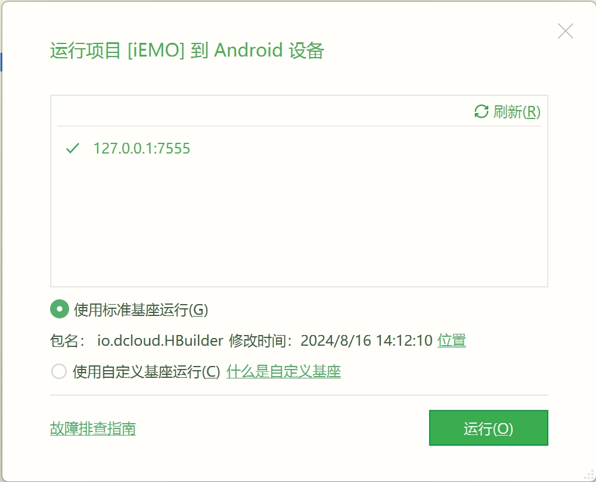
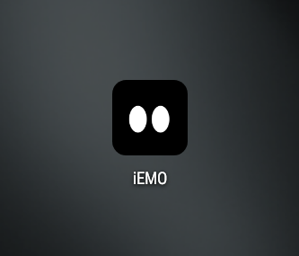
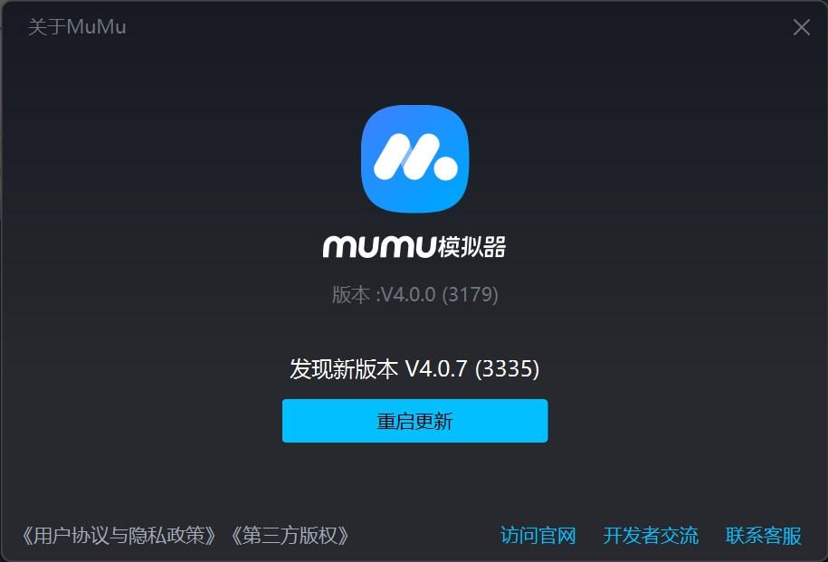
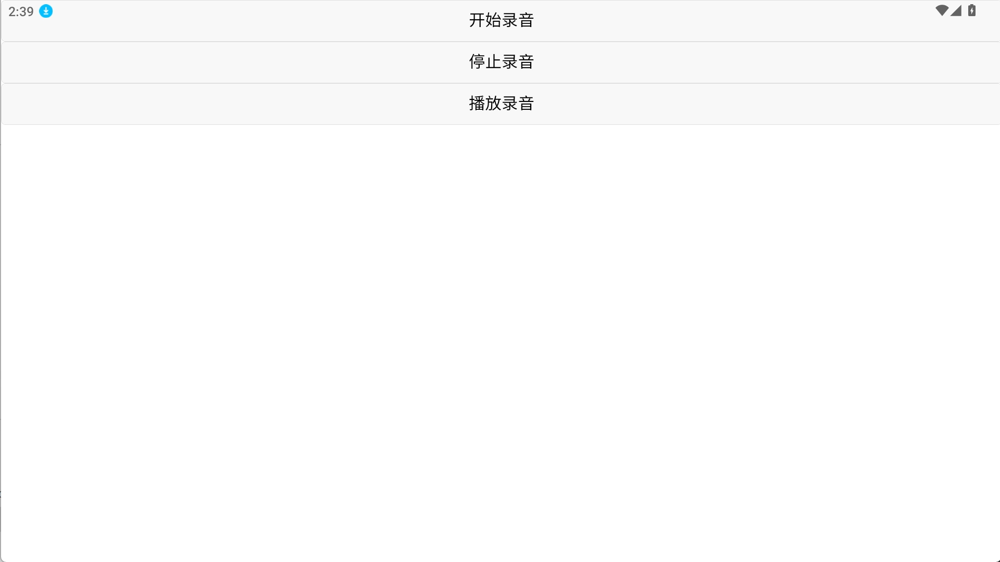
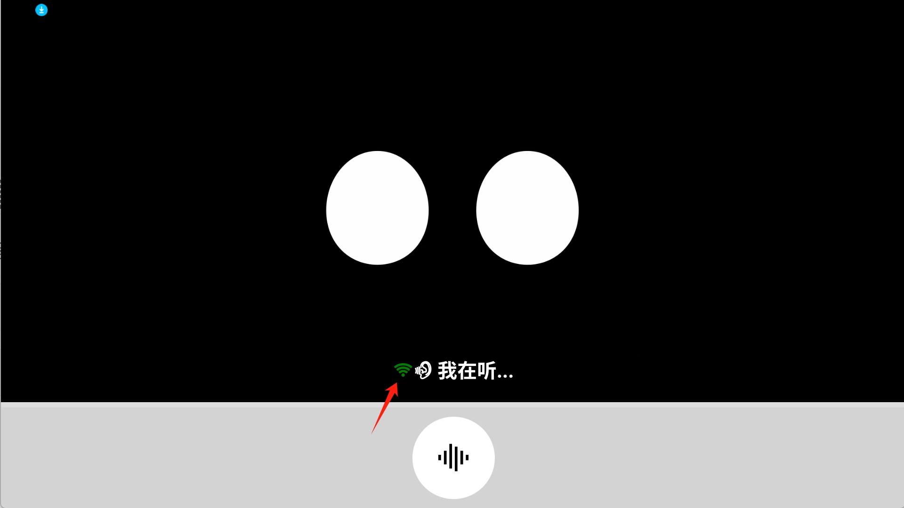

# iEMO 手机终端

手机客户端基于`uni-app`开发。提供两种安装方式，可以选择其中一种方式安装使用。


## ✅待办
- [ ] 调用麦克风采集音频，将采集的音频上传到服务器。
- [ ] 验证Android真机音频是否可以正常采集、扬声器是否可以调用。
- [ ] iOS打包，验证Apple手机音频是否可以正常采集、扬声器是否可以调用。
- [ ] 验证iOS、Android终端socket通信是否可用。
- [ ] 对接MQTT，推、拉音频数据流。


## 安装
#### Android端运行
**方式一：**

- 运行源码进行真机调试 。目前只调试过MuMu模拟器。Android真机还未尝试过。
- 有关更多运行细节请参考[ App平台：真机运行](https://uniapp.dcloud.net.cn/tutorial/run/run-app.html)

**<s>方式二（推荐）：</s>**

- 安装打包好的程序`iEMO-debug.apk`。
	


> [!TIP]
> 注：只在该模拟器环境验证过： `MuMu模拟器，版本 :V4.0.0 (3179)`。安卓真机、苹果设备、鸿蒙、小程序均未验证。


### iOS端运行
**待验证**


## 麦克风调用示例
这是一个测试通过的用例，我还没有集成到首页当中。你可以将启动页替换成`pages/index/record`来获取麦克风调用案例。
```
"pages": [
		{
			// "path": "pages/index/index",
			"path": "pages/index/record", //替换成这个页面
			"style": {
				"navigationBarTitleText": "",
				"navigationStyle":"custom"
			}
		}
	],
```


## 建立socket连接
运行`server`目录下的脚本后打印表示服务端socket通道创建完毕。
```
python websocketserver.py
```
```
WebSocket server started at ws://192.168.2.59:8888
```
`绿色Wi-Fi图标`表示客户端上线（启动顺序：先服务端，后客户端。还未支持掉线重连）。
