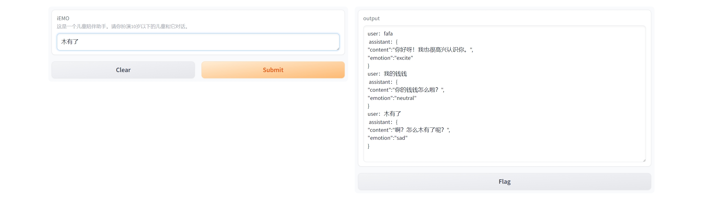

# iEMO LLM模块

这是iEMO的大脑。在这里处理语义及制定对话策略等。
现，调用的是扣子模型 https://www.coze.cn/


## ✅待办

- [ ] 需要传入用户身份，将聊天历史存入数据库。
- [ ] 对话策略逻辑等。

## 配置
配置`send.py`文件的 bot_id 和 Authorization
## 运行
```
python run.py
```
你可以在本地，进行文本聊天测试。
http://127.0.0.1:7860/





